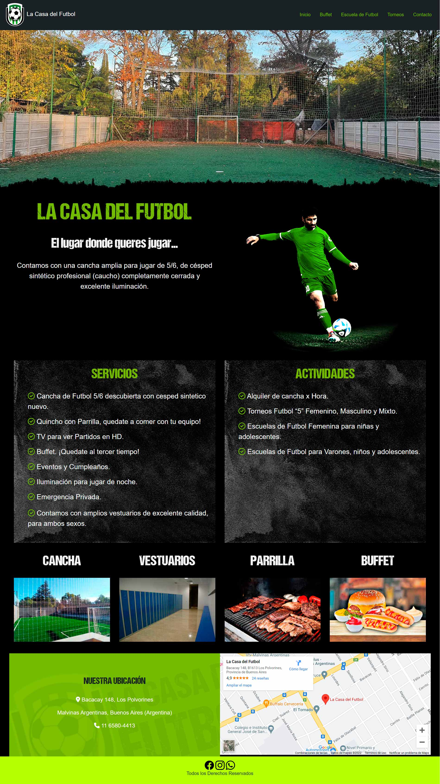

# La Casa del Futbol

Sitio creado para el aprendizaje en clase de "Desarrollo Web de CoderHouse".

## El sitio fue subido a https://la-casa-del-futbol.vercel.app/

### Para la maquetación y diseño se utilizo:
HTML 5, CSS 3, SASS, Bootstrap.
